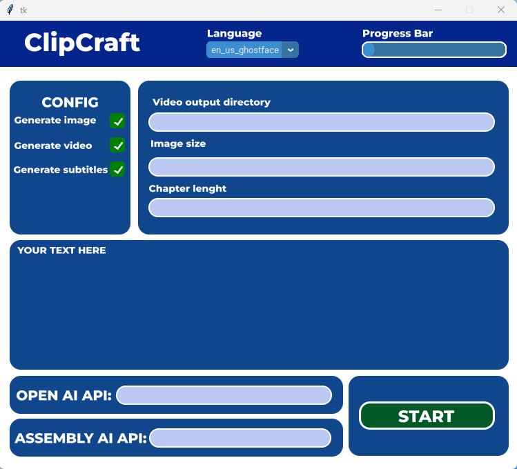
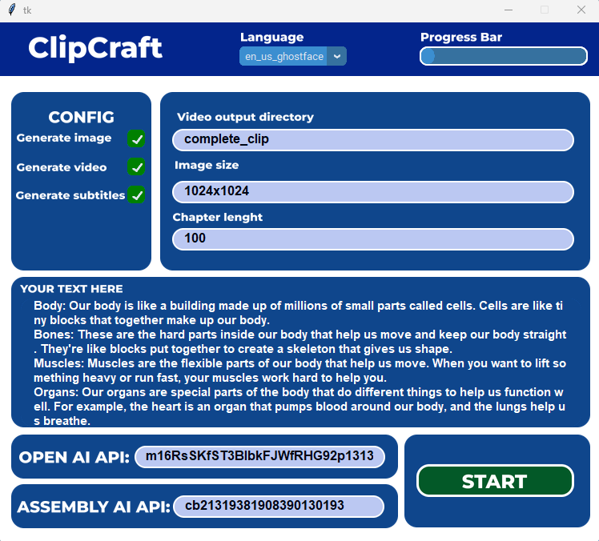

# ClipCraft 🚀

This software is a simple program that generates video just from text using OpenAI and AssemblyAI API. 


## Installation

This project requires internet connection to install all the modules. You can download them manually or with requirements.txt

```terminal
  cd ClipCraft
```
```terminal
  pip3 install -r requirements.txt
```
    
## Usage/Examples

When you open the gui.py file after successfully installing the modules you will see some options that I will try to present to you now:
 - Language - you can choose language of narrator in the video but please make sure that option you choose matches the text in "YOUR TEXT HERE" area,
 - Video output directory - path to directory where your video will be saved
 - Image size - size of images that will be generated for each chapter
 - Chapter lenght - values given here will affect the number of generated images e. g. giving the value of 100 means that each chapter will have 100 characters
 - OPEN AI API - you can get api from [here](https://platform.openai.com/api-keys)
 - ASSEMBLY AI API - you can get api from [here](https://www.assemblyai.com/app/)

 The size of the generated images. Must be one of `1024x1024`, `1792x1024`, or
              `1024x1792` for `dall-e-3` model which is used in this project.

You can watch examples of complete vidoes [here](https://www.youtube.com/playlist?list=PLlVNFvFbjZ3G73D6XfwyN_exaYW9FQOk6).
## Screenshots





## Credits

- [@oscie](https://github.com/oscie57) - this project is using [TikTok Voice TTS](https://github.com/oscie57/tiktok-voice) from his repositories.

